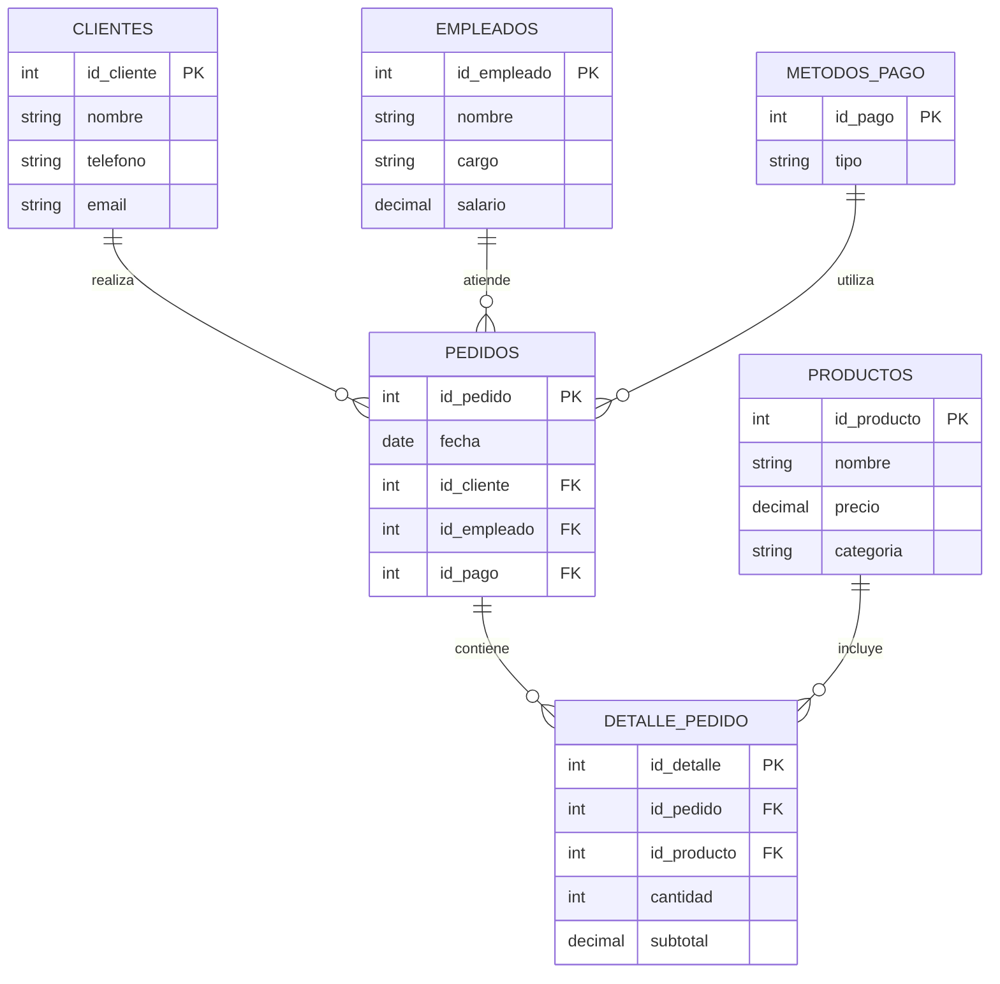

# ☕ Cafetería App

Aplicación CRUD completa para gestionar una cafetería, desarrollada con **React** en el frontend, **Express + Node.js** en el backend, y **MySQL** como base de datos relacional.

---

## 📦 Tecnologías Utilizadas

- ⚛️ React (Frontend)
- 🟩 Node.js + Express (Backend)
- 🐬 MySQL (Base de datos)
- 🔁 Axios (HTTP requests)
- 🌐 CORS, Body-Parser (middlewares)
- 🗃️ MySQL Workbench (gestión de base de datos)

---

# 🫖 Base de Datos Cafetería

Este es el **diagrama entidad-relación (ERD)** de la base de datos para la cafetería.  
Incluye Clientes, Empleados, Productos, Métodos de Pago, Pedidos y Detalle de Pedido.



---

## 🚀 Instrucciones de Instalación

### 1️⃣ Clonar el repositorio

```bash
git clone https://github.com/tu-usuario/cafeteria-app.git
cd cafeteria-app
```

2️⃣ Configurar la Base de Datos

Abre MySQL Workbench u otra herramienta.

Ejecuta el script SQL ubicado en db/schema.sql:
```bash
SOURCE db/schema.sql;
```
Esto creará la base de datos cruddb con las tablas necesarias (Clientes, Empleados, Productos, etc.).


3️⃣ Iniciar el servidor (Backend)

```bash
cd server
npm install
node index.js
```
El backend corre en http://localhost:3001


4️⃣ Iniciar la app (Frontend)
cd ../client
npm install
npm start

```bash
La app se abre automáticamente en http://localhost:3000
```
